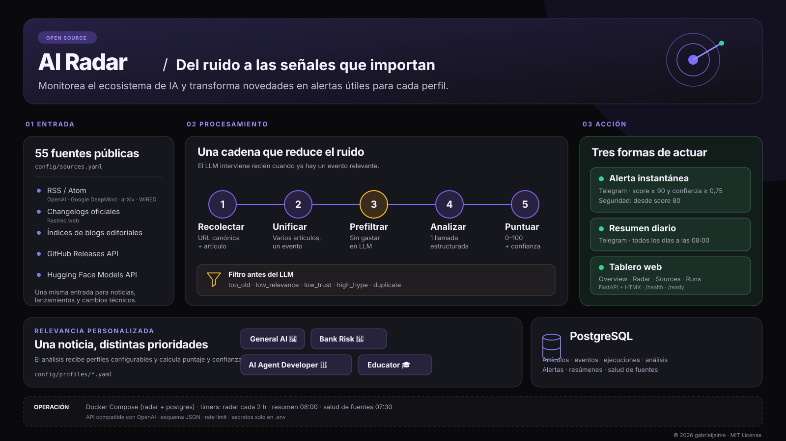

# AI Radar

[English](README.md) | **Español**

Radar configurable para descubrir cambios relevantes en inteligencia artificial y convertirlos en señales accionables. Consulta fuentes públicas, normaliza y agrupa artículos en eventos, descarta ruido antes de llamar al LLM, evalúa cada evento contra perfiles configurables, persiste el resultado y puede enviar una alerta consolidada por Telegram.

El proyecto está preparado para ejecutarse localmente o en un servidor Linux. No contiene credenciales reales: las claves y tokens se leen exclusivamente desde variables de entorno.

<p align="center">
  
</p>

## Estado del proyecto

Este repositorio contiene un vertical slice operativo. El dashboard FastAPI, los collectors, el pipeline de scoring, PostgreSQL y las alertas de Telegram están implementados. Tavily, feedback, research agents, embeddings y una API operacional de escritura quedan fuera del alcance actual.

## Alcance implementado

```text
sources → normalize → event deduplication → prefilter
    → one structured LLM analysis (all active profiles) → deterministic scoring
    → PostgreSQL → one consolidated Telegram alert
```

FastAPI expone el dashboard operativo, además de `GET /health` y `GET /ready`.

## Requisitos

| Qué | Para qué | Obligatorio |
| --- | --- | --- |
| [Git](https://git-scm.com/downloads) | Descargar el repositorio | Sí |
| [Docker Desktop](https://www.docker.com/products/docker-desktop/) (Windows/macOS) o Docker Engine + Compose plugin (Linux) | PostgreSQL y, opcionalmente, la app completa | Sí |
| [Python 3.12](https://www.python.org/downloads/) | Sólo para la opción B (desarrollo sin Docker para la app) | No |
| Una API key de un proveedor LLM compatible con OpenAI Chat Completions y `response_format: json_schema` (por ejemplo OpenAI) | Analizar y puntuar los eventos | Para corridas reales |
| Un bot de Telegram y el ID de un chat | Recibir alertas y digests | No |

Sin API key el radar igual recolecta y prefiltra noticias; sin Telegram procesa y guarda todo, pero no envía mensajes.

## Instalación paso a paso

### 1. Clonar el repositorio

```bash
git clone https://github.com/gabrieljaime/ia-radar.git
cd ia-radar
```

### 2. Crear el archivo `.env`

Linux / macOS:

```bash
cp .env.example .env
```

Windows (PowerShell):

```powershell
Copy-Item .env.example .env
```

### 3. Completar `.env`

Abra `.env` con cualquier editor y complete:

1. **Contraseña de la base de datos.** Reemplace `replace-with-a-long-random-password` por una
   contraseña larga y aleatoria. Aparece **dos veces** (en `POSTGRES_PASSWORD` y dentro de
   `DATABASE_URL`) y ambas deben ser idénticas. Use sólo letras y números para evitar tener que
   escapar caracteres en la URL. Para generar una:
   - Linux / macOS: `openssl rand -hex 32`
   - Windows (PowerShell): `-join ((48..57)+(97..102) | Get-Random -Count 32 | % {[char]$_})`
2. **LLM** (necesario para analizar eventos):
   - `LLM_API_KEY`: su clave del proveedor.
   - `LLM_MODEL`: un modelo que soporte structured outputs (por defecto `gpt-4.1-nano`).
   - `LLM_BASE_URL`: base URL del proveedor (por defecto la de OpenAI).
   - `LLM_INPUT_COST_PER_MILLION_USD` / `LLM_OUTPUT_COST_PER_MILLION_USD`: opcionales, sólo para
     estimar costos en el dashboard.
3. **Telegram** (opcional):
   - `TELEGRAM_BOT_TOKEN`: hable con [@BotFather](https://t.me/BotFather), envíe `/newbot` y copie
     el token que le devuelve.
   - `TELEGRAM_CHAT_ID`: envíe cualquier mensaje a su bot y abra
     `https://api.telegram.org/bot<TOKEN>/getUpdates`; el número en `"chat":{"id": ...}` es el
     chat ID.
   - Si deja ambas vacías, Telegram queda desactivado.
4. `OUTPUT_LANGUAGE`: idioma del contenido generado (`es` por defecto). Los nombres técnicos, APIs,
   frameworks y nombres propios se conservan en su idioma original.

El resto de las variables tienen valores por defecto razonables. `.env` está en `.gitignore`: nunca
lo suba al repositorio.

Luego elija **una** de las dos opciones siguientes.

### 4A. Opción A: todo con Docker (recomendada)

No requiere instalar Python. Con Docker Desktop abierto:

```bash
docker compose build
docker compose up -d postgres
docker compose run --rm radar python -m alembic upgrade head
docker compose up -d radar
```

Abra <http://localhost:8000> para ver el dashboard. Para comprobar que responde:

```bash
curl http://localhost:8000/health
curl http://localhost:8000/ready
```

Primera corrida de prueba (analiza con el LLM, guarda en la base y **no** envía Telegram):

```bash
docker compose run --rm radar python scripts/run_radar.py --dry-run
```

Cualquier otro script de la sección [Uso](#uso) se ejecuta igual, anteponiendo
`docker compose run --rm radar`. Por ejemplo:

```bash
docker compose run --rm radar python scripts/run_radar.py
docker compose run --rm radar python scripts/send_digest.py --dry-run
```

Para detener todo: `docker compose down` (los datos se conservan en el volumen
`ai_radar_postgres`; `docker compose down -v` los borra).

Después de actualizar el código (`git pull`), reconstruya y aplique migraciones:

```bash
docker compose build
docker compose run --rm radar python -m alembic upgrade head
docker compose up -d radar
```

### 4B. Opción B: Python local + PostgreSQL en Docker (desarrollo)

PostgreSQL corre en Docker y queda expuesto sólo en `127.0.0.1:5432` gracias a
`docker-compose.dev.yml`; la app corre en un entorno virtual de Python.

```bash
docker compose -f docker-compose.yml -f docker-compose.dev.yml up -d postgres
```

Crear el entorno virtual e instalar dependencias:

Linux / macOS:

```bash
python3.12 -m venv .venv
source .venv/bin/activate
pip install -e ".[dev]"
```

Windows (PowerShell):

```powershell
py -3.12 -m venv .venv
.venv\Scripts\Activate.ps1
pip install -e ".[dev]"
```

> Si PowerShell bloquea la activación, ejecute una vez
> `Set-ExecutionPolicy -Scope CurrentUser RemoteSigned`.

Crear las tablas y levantar el dashboard:

```bash
alembic upgrade head
uvicorn app.main:app --reload
```

Abra <http://localhost:8000>. En otra terminal (con el entorno virtual activado) haga la primera
corrida de prueba:

```bash
python scripts/run_radar.py --dry-run
```

### 5. Automatizar las corridas (opcional)

El radar no se programa solo: cada ejecución de `scripts/run_radar.py` hace una pasada. Para un
servidor Linux hay timers systemd listos en `deploy/systemd/` y una guía completa en
[`docs/production-deployment.md`](docs/production-deployment.md). En otros entornos puede usar
cron o el Programador de tareas de Windows para ejecutar el comando de la opción elegida.

### Problemas frecuentes

- **`set POSTGRES_PASSWORD in .env`**: falta `.env` o la variable está vacía; revise el paso 3.
- **`password authentication failed`**: las dos contraseñas de `.env` no coinciden, o se cambió la
  contraseña después de crear la base. En una instalación nueva puede empezar de cero con
  `docker compose down -v` (borra los datos).
- **`connection refused` en la opción B**: PostgreSQL no está corriendo o se levantó sin
  `-f docker-compose.dev.yml`, por lo que el puerto 5432 no está expuesto.
- **`ports are not available ... 5432`, o `password authentication failed` en la opción B aunque
  las contraseñas coinciden**: ya hay otro PostgreSQL usando el puerto 5432 en su máquina (habitual
  en Windows). Agregue `POSTGRES_HOST_PORT=5433` al `.env`, cambie `:5432/` por `:5433/` en
  `DATABASE_URL` y vuelva a levantar PostgreSQL con el comando de la opción B.
- **El puerto 8000 ya está en uso**: detenga el otro servicio que lo ocupa, o en la opción B use
  `uvicorn app.main:app --reload --port 8001`.
- **Los eventos quedan en `pending`**: falta `LLM_API_KEY`; complete el paso 3 y vuelva a correr.

Para Supabase u otro PostgreSQL administrado, ponga su URL en `DATABASE_URL` (con el SSL que
requiera la instancia) y use la opción B sin levantar el contenedor `postgres`.

No introduzca valores reales en `.env.example`, workflows, fixtures o documentación.

## Seguridad y privacidad

- No suba `.env`, tokens, claves LLM, credenciales de base de datos ni identificadores privados.
- Si una credencial aparece alguna vez en un archivo rastreado o en un log compartido, revóquela y genere otra; eliminar el archivo no la elimina del historial.
- Las credenciales de GitHub Actions deben configurarse como GitHub Secrets. Los valores de prueba de PostgreSQL del workflow son efímeros y sólo se usan dentro del runner.
- Las fuentes configuradas son URLs públicas. Revise `config/sources.yaml` antes de añadir endpoints internos o feeds con acceso restringido.

## Uso

Los comandos de esta sección asumen la opción B (entorno virtual activado). Con la opción A,
anteponga `docker compose run --rm radar` a cada `python scripts/...`.

```bash
python scripts/run_radar.py
```

Para una corrida real sin entregar mensajes a Telegram:

```bash
python scripts/run_radar.py --dry-run
```

El dry-run persiste normalmente y, si hay credenciales LLM, imprime cada alerta elegible entre
`WOULD_ALERT` y `END_WOULD_ALERT`. Sin credenciales procesa hasta el prefilter y deja los eventos
en estado `pending` para que una corrida posterior pueda analizarlos.

Para validar feeds sin LLM ni Telegram:

```bash
python scripts/check_feeds.py
```

Para validar juntas todas las fuentes RSS, `web_changelog` y `web_articles`, incluyendo estado HTTP,
cantidad de entradas, fecha más reciente y estado de parsing, sin llamar al LLM:

```bash
python scripts/check_sources.py
```

Para inspeccionar y calibrar la última corrida persistida, sin consumir llamadas LLM ni acceder
a servicios externos:

```bash
python scripts/show_latest_run.py
python scripts/show_latest_run.py --details
```

También se puede seleccionar una corrida con `--run-id <UUID>` o limitar la salida con `--limit`.

Para inspeccionar la evidencia cruda de un `candidate_record` y distinguir errores de collector,
dedupe o análisis, sin llamadas externas:

```bash
python scripts/show_candidate.py <candidate-record-uuid>
```

Para revisar el digest sin enviar Telegram ni crear una reserva de envío:

```bash
python scripts/send_digest.py --dry-run
```

Para enviarlo utilizando exclusivamente análisis ya persistidos:

```bash
python scripts/send_digest.py
```

Durante el desarrollo, `--force` permite ignorar la protección contra duplicados:

```bash
python scripts/send_digest.py --force
```

El digest admite además `--hours 48` y `--run-id <UUID>`. No consulta RSS, no recalcula
scores y realiza cero llamadas al LLM; el único acceso externo de un envío real es Telegram.

Para probar exclusivamente la entrega de Telegram, sin modificar thresholds:

```bash
python scripts/test_telegram.py
```

Cada corrida registra un `run_id`. Los fallos de una fuente, un artículo, structured output o Telegram quedan aislados. Cada item recolectado tiene un `candidate_record`; los descartes se guardan como `duplicate`, `already_seen`, `too_old`, `low_relevance`, `low_trust`, `high_hype`, `invalid` o `analysis_failed` sin sobrescribir la historia del artículo original.

Para levantar únicamente los probes HTTP:

```bash
uvicorn app.main:app --reload
curl http://localhost:8000/health
curl http://localhost:8000/ready
```

## Fuentes y perfiles dinámicos

- `config/sources.yaml` agrupa fuentes configurables por tipo: `rss`, `web_changelog`,
  `web_articles`, `github_releases` y `huggingface_models`.
- `rss` consume feeds estructurados; `web_changelog` extrae releases o cambios técnicos de una
  página oficial; `web_articles` extrae solamente las tarjetas visibles de un índice editorial.
  Siempre se prefiere un RSS/Atom oficial y estable al parser HTML.
- La selección actual cubre laboratorios y changelogs oficiales, investigación de seguridad y
  alineamiento en arXiv, el International AI Safety Report y análisis secundarios de WIRED y
  Normal Technology. También incorpora investigación institucional de Google y Amazon, estándares
  de NIST, adopción educativa, infraestructura y economía de IA, ciencia y mercado. Los libros y
  artículos individuales usados como bibliografía no se tratan como feeds: sus publicaciones
  originales quedan cubiertas por los canales vivos correspondientes.
- Cada feed RSS procesa como máximo sus 100 entradas más recientes por corrida (configurable con
  `limit`) para evitar reingestar historiales completos de feeds muy grandes.
- Las fuentes `web_changelog` usan parsers HTML pequeños y específicos; cada entrada se convierte
  en un `Candidate` independiente y la URL canónica existente conserva la idempotencia entre corridas.
- Para agregar una fuente RSS se agrega una entrada bajo `rss`. Para un changelog se agrega bajo
  `web_changelog` con `parser`, `enabled`, `trust_level`, `is_primary` y, cuando corresponda,
  `requires_primary_verification`.
- Cada parser de `web_articles` recibe HTML y URL base y devuelve una lista uniforme de
  `ArticleIndexItem(title, url, published_at, summary)`. Para agregar uno, implementar una función
  específica en `app/collectors/web_articles.py`, registrarla en `PARSERS`, añadir fixtures locales
  de estructura válida y cambiada, y habilitar la fuente sólo después de `check_sources.py`.
  El collector hace una petición al índice y nunca descarga el cuerpo de cada artículo.
- `github_releases` consume la API oficial de GitHub, ignora drafts y no inspecciona commits, PRs
  ni tags. `huggingface_models` consulta la API pública por organización y usa `model id` y
  `createdAt`; cambios posteriores de README o metadata conservan la misma identidad.
- La evidencia secundaria se persiste con `requires_primary_verification` y una evidencia primaria
  posterior actualiza el mismo evento. La política de alerta inmediata conserva por ahora la lógica
  existente: distinguir automáticamente cobertura secundaria de análisis original del autor requiere
  una señal editorial explícita y queda para una iteración posterior; no se bloquean análisis propios
  sólo por publicarse en una fuente experta.
- Cada YAML dentro de `config/profiles/` define un perfil con `slug`, `name`, `icon`,
  `description`, señales gratuitas y `enabled`.
- Agregar una fuente o tema no requiere cambios de código; la configuración se valida al cargarla.

Para desactivar temporalmente un perfil sin borrar sus scores históricos:

```yaml
slug: bank_risk
name: Bank Risk Intelligence
icon: "🏦"
enabled: false
```

Para agregar un interés nuevo, alcanza con crear otro YAML:

```yaml
slug: my_profile
name: My Profile
icon: "🔎"
enabled: true
description: Novedades relevantes para este interés.
topics:
  relevant_topic: 1.0
```

Todos los perfiles activos se incorporan automáticamente a la misma llamada LLM por evento. Un
perfil deshabilitado no participa del prompt, scoring, alerta, digest ni visualización actual, pero
sus registros históricos permanecen en PostgreSQL.

## Tests y lint

Los tests no llaman servicios externos ni consumen APIs pagas. RSS, LLM y Telegram tienen fixtures/fakes o transportes HTTP mockeados.

```bash
pytest
ruff check .
ruff format --check .
```

Los fixtures reproducibles están en `tests/fixtures/`.

Los workflows `Tests`, `RSS smoke test` y `AI Radar dry-run` pueden iniciarse manualmente con
`workflow_dispatch`. El dry-run toma credenciales exclusivamente de GitHub Secrets.

## Idempotencia y entregas

- URL canónica única impide insertar dos veces el mismo artículo.
- La similitud conservadora de títulos agrupa coberturas distintas en un evento.
- Sólo los eventos nuevos llegan al LLM.
- Un constraint permite una única alerta inmediata de Telegram por evento.
- La alerta se persiste como `pending` antes del request y luego queda `sent` o `failed`; un fallo no borra su estado ni provoca reenvíos automáticos ambiguos.

Consulte la propuesta y el plan posterior en [`docs/architecture-proposal.md`](docs/architecture-proposal.md).

## Producción en servidor Linux

El deployment estable usa Docker Compose para `postgres` y `radar`, y timers systemd del host para
Radar, digest y health de fuentes. GitHub Actions no programa ejecuciones de producción. Consulte
[`docs/production-deployment.md`](docs/production-deployment.md) para instalación Ubuntu desde cero,
validación sin Telegram, operación, backups, restore y rollback.

## Licencia

© 2026 [gabrieljaime](https://github.com/gabrieljaime). Distribuido bajo la licencia [MIT](LICENSE). Puede usar, copiar, modificar y redistribuir el código,
incluso en proyectos comerciales, siempre que conserve el aviso de copyright y la licencia.
